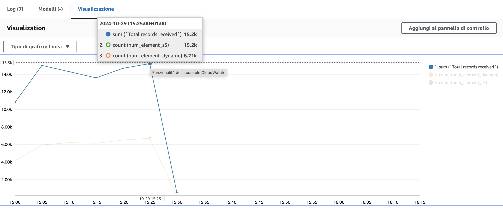
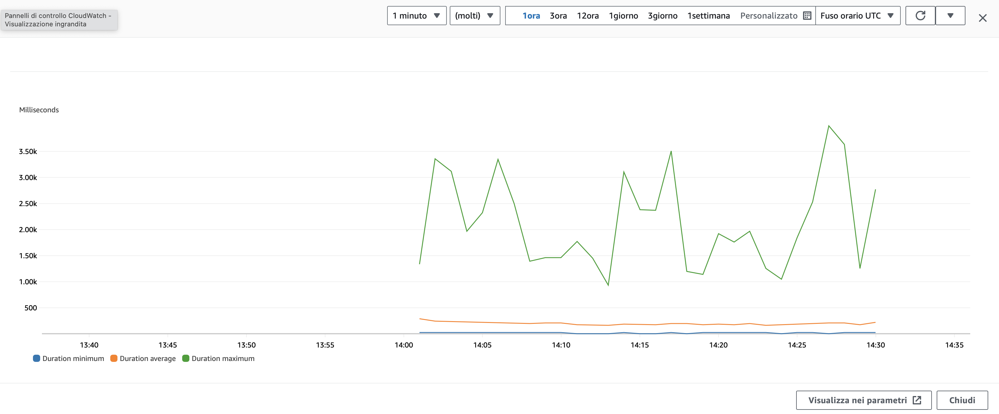
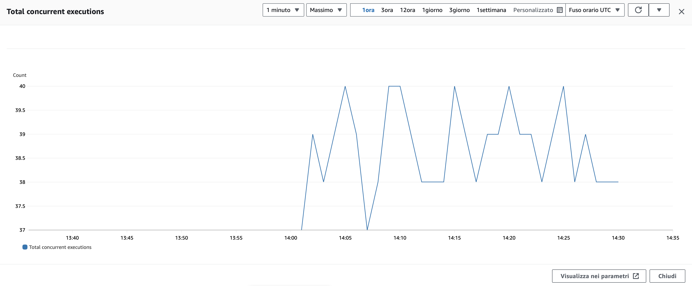

# kinesis-stream-setup-example
This project comes from my experience during my internship as a backend engineer. the project provides a set of YAML template and a lambda function that helped me with the development of a Kinesis Stream application.

## Table of Contents
- [Introduction](#introduction)
- [Features](#features)
- [Images](#images)
- [Results](#results)

## Introduction
This repository is not a complete or production-ready solution but rather a collection of the templates and Lambda functions I utilized during my internship.
During this experience, I was asked to develop a kinesis stream application capable of handling real user traffic efficiently. The architecture needed to scale automatically based on workload demands. Ultimately, I managed to process over 80,000 messages within a 30-minute window, successfully storing data in S3 buckets and DynamoDB tables.

## Features
- **Storage**: YAML CloudFormation templates for setting up DynamoDB tables and S3 buckets.
- **Stream**: YAML template used for configuring the Kinesis Stream.
- **Api**: A template for an API that sends messages to the Kinesis Stream via POST requests. Instead of using a Producer Lambda, as suggested by AWS guidelines, I opted out to minimize the number of active Lambda functions in our AWS environment. I used this approach because I didn't need to preprocess the messages. 
- **Lambda**: The Consumer Lambda function for processing records from the Kinesis Stream.

## Images

