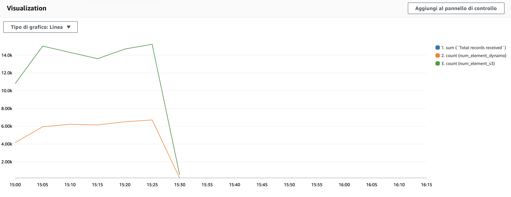

# kinesis-stream-setup-example
This project comes from my experience during my internship as a backend engineer. the project provides a set of YAML template and Lambda Function that helped me with the development of a Kinesis Stream application.

## Table of Contents
- [Introduction](#introduction)
- [Features](#features)
- [Images](#images)
- [Results](#results)

## Introduction
During my internship, I worked extensively on Kinesis Stream applications and learned how to set up and optimize stream processing using AWS services. This project is a simplified example to demonstrate how you can configure and consume Kinesis Streams using AWS Lambda and other related AWS services.

## Features
- **Kinesis Stream Setup**: Includes a YAML CloudFormation template to quickly set up a Kinesis Stream.
- **S3 and DynamoDB Integration**: Example templates to create and link S3 and DynamoDB resources.
- **Lambda Consumer Function**: A sample Lambda function for processing incoming Kinesis Stream records.
- **Metrics Logging**: Example code logs metrics like record size and processing rate.

## Images

## Images
- **Results**

